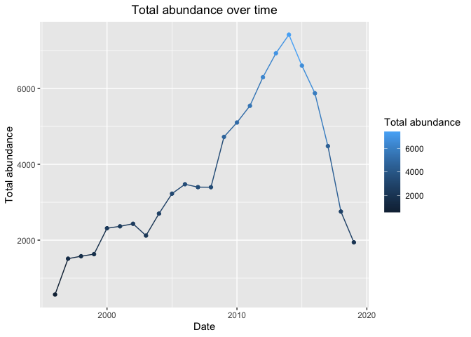
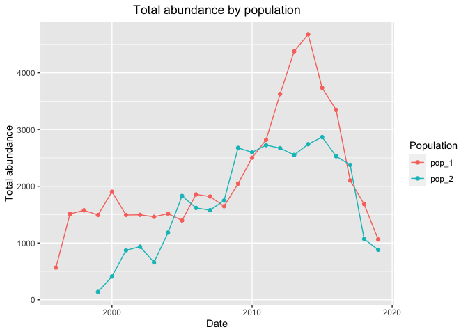
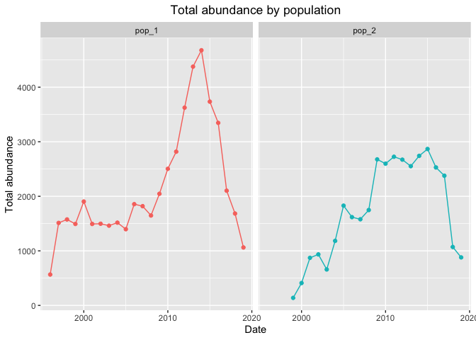
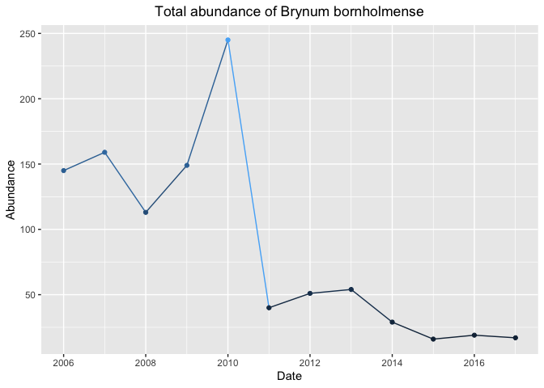

Week 4 Homework
================
Daniel Li
25/10/2021

-   [Task](#task)
-   [Code](#code)
    -   [Graph 1: Total abundance over
        time](#graph-1-total-abundance-over-time)
    -   [Graph 2: Population 1 vs 2 total abundance over
        time](#graph-2-population-1-vs-2-total-abundance-over-time)
    -   [Graph 3: Bryum bornholmense abundance over
        time](#graph-3-bryum-bornholmense-abundance-over-time)

# Task

Visualise time series data from last week’s (week 3) data set on
abundances

# Code

Load packages

``` r
# Load packages
library(vroom)
library(tidyverse)
```

    ## Registered S3 methods overwritten by 'readr':
    ##   method                    from 
    ##   as.data.frame.spec_tbl_df vroom
    ##   as_tibble.spec_tbl_df     vroom
    ##   format.col_spec           vroom
    ##   print.col_spec            vroom
    ##   print.collector           vroom
    ##   print.date_names          vroom
    ##   print.locale              vroom
    ##   str.col_spec              vroom

    ## ── Attaching packages ─────────────────────────────────────── tidyverse 1.3.1 ──

    ## ✓ ggplot2 3.3.5     ✓ purrr   0.3.4
    ## ✓ tibble  3.1.5     ✓ dplyr   1.0.7
    ## ✓ tidyr   1.1.4     ✓ stringr 1.4.0
    ## ✓ readr   2.0.2     ✓ forcats 0.5.1

    ## ── Conflicts ────────────────────────────────────────── tidyverse_conflicts() ──
    ## x readr::col_character()  masks vroom::col_character()
    ## x readr::col_date()       masks vroom::col_date()
    ## x readr::col_datetime()   masks vroom::col_datetime()
    ## x readr::col_double()     masks vroom::col_double()
    ## x readr::col_factor()     masks vroom::col_factor()
    ## x readr::col_guess()      masks vroom::col_guess()
    ## x readr::col_integer()    masks vroom::col_integer()
    ## x readr::col_logical()    masks vroom::col_logical()
    ## x readr::col_number()     masks vroom::col_number()
    ## x readr::col_skip()       masks vroom::col_skip()
    ## x readr::col_time()       masks vroom::col_time()
    ## x readr::cols()           masks vroom::cols()
    ## x readr::default_locale() masks vroom::default_locale()
    ## x dplyr::filter()         masks stats::filter()
    ## x readr::fwf_cols()       masks vroom::fwf_cols()
    ## x readr::fwf_empty()      masks vroom::fwf_empty()
    ## x readr::fwf_positions()  masks vroom::fwf_positions()
    ## x readr::fwf_widths()     masks vroom::fwf_widths()
    ## x dplyr::lag()            masks stats::lag()
    ## x readr::locale()         masks vroom::locale()
    ## x readr::output_column()  masks vroom::output_column()
    ## x readr::problems()       masks vroom::problems()

``` r
library(lubridate)
```

    ## 
    ## Attaching package: 'lubridate'

    ## The following objects are masked from 'package:base':
    ## 
    ##     date, intersect, setdiff, union

Read in the data

``` r
##read in the data
setwd(dirname(rstudioapi::getActiveDocumentContext()$path))
wide_spp.1 <- vroom("../../data/Workshop 3/to_sort_pop_1.csv")
```

    ## Rows: 30 Columns: 29

    ## ── Column specification ────────────────────────────────────────────────────────
    ## Delimiter: "\t"
    ## chr  (4): species, primary_threat, secondary_threat, tertiary_threat
    ## dbl (24): pop_1_2003-01-01, pop_1_2004-01-01, pop_1_2005-01-01, pop_1_2006-0...
    ## lgl  (1): pop_1_1995-01-01

    ## 
    ## ℹ Use `spec()` to retrieve the full column specification for this data.
    ## ℹ Specify the column types or set `show_col_types = FALSE` to quiet this message.

``` r
wide_spp.2 <- vroom("../../data/Workshop 3/to_sort_pop_2.csv")
```

    ## Rows: 30 Columns: 28

    ## ── Column specification ────────────────────────────────────────────────────────
    ## Delimiter: "\t"
    ## chr  (4): species, primary_threat, secondary_threat, tertiary_threat
    ## dbl (21): pop_2_2000-01-01, pop_2_2001-01-01, pop_2_2002-01-01, pop_2_2003-0...
    ## lgl  (3): pop_2_1996-01-01, pop_2_1997-01-01, pop_2_1998-01-01

    ## 
    ## ℹ Use `spec()` to retrieve the full column specification for this data.
    ## ℹ Specify the column types or set `show_col_types = FALSE` to quiet this message.

``` r
## code to reshape data
## first join the data using full join - this will keep all of the columns
long_spp <- full_join(wide_spp.1, wide_spp.2) %>%
              ## pivot the joined data frame, using species, primary_threat, secondary_threat, tertiary_threat as ID columns
              ## and using names-pattern to pull out the population number
              ## and make a new column (called population) to store them in.
              ##Drop the NAs.
               pivot_longer(cols = -c(species,
                                      primary_threat,
                                      secondary_threat,
                                      tertiary_threat),
                            names_to = c("population", "date"),
                            names_pattern = "(.*)_(.*)",
                            values_drop_na = T,
                            values_to = "abundance")
```

    ## Joining, by = c("species", "primary_threat", "secondary_threat", "tertiary_threat")

Fix data frame

``` r
# convert date column from chr to date
long_spp$date <- as_date(long_spp$date)
head(long_spp)
```

    ## # A tibble: 6 × 7
    ##   species  primary_threat secondary_threat tertiary_threat population date      
    ##   <chr>    <chr>          <chr>            <chr>           <chr>      <date>    
    ## 1 Schisti… Habitat destr… <NA>             <NA>            pop_1      2013-01-01
    ## 2 Schisti… Habitat destr… <NA>             <NA>            pop_1      2014-01-01
    ## 3 Schisti… Habitat destr… <NA>             <NA>            pop_1      2015-01-01
    ## 4 Schisti… Habitat destr… <NA>             <NA>            pop_1      2016-01-01
    ## 5 Schisti… Habitat destr… <NA>             <NA>            pop_1      2017-01-01
    ## 6 Schisti… Habitat destr… <NA>             <NA>            pop_1      2018-01-01
    ## # … with 1 more variable: abundance <dbl>

``` r
# remove NAs (commented out as NAs removed in full_join pivot earlier)
#long_spp <- drop_na(long_spp)
```

## Graph 1: Total abundance over time

``` r
# na.rm is superfluous as NAs already removed
abundance_year <- long_spp %>%
            group_by(date) %>%
            summarise("total.abundance" = sum(abundance, na.rm = T))
head(abundance_year)
```

    ## # A tibble: 6 × 2
    ##   date       total.abundance
    ##   <date>               <dbl>
    ## 1 1996-01-01             566
    ## 2 1997-01-01            1512
    ## 3 1998-01-01            1576
    ## 4 1999-01-01            1631
    ## 5 2000-01-01            2314
    ## 6 2001-01-01            2365

``` r
abundance_year_gg <- ggplot(data = abundance_year, aes(x = date, y = total.abundance))

# check to ensure we dont have any issues in the data (like NAs)
which(is.na(abundance_year_gg$abundance))
```

    ## integer(0)

``` r
abundance_year_gg + geom_line(aes(col = total.abundance)) +
                geom_point(aes(col = total.abundance)) +
                ggtitle("Total abundance over time") +
                theme(plot.title = element_text(hjust = 0.5)) +
                xlab("Date") +
                ylab("Total abundance") +
                labs(col = "Total abundance")
```

<!-- -->

No need to export graph to file as R Markdown knits graphs into finished
document

``` r
# # export graph to file
# pdf("./Plots/homework/Total abundance over time.pdf", width = 6, height = 4)

#     abundance_year_gg + geom_line(aes(col = total.abundance)) +
#                         geom_point(aes(col = total.abundance)) +
#                         ggtitle("Total abundance over time") +
#                         theme(plot.title = element_text(hjust = 0.5)) +
#                         xlab("Date") +
#                         ylab("Total abundance") +
#                         labs(col = "Total abundance")

# dev.off()
```

## Graph 2: Population 1 vs 2 total abundance over time

Graphs generated for data overlayed and data on seperate graphs

``` r
abundance_population_year <- long_spp %>%
            group_by(population, date) %>%
            summarise("total.abundance" = sum(abundance, na.rm = T))
```

    ## `summarise()` has grouped output by 'population'. You can override using the `.groups` argument.

``` r
head(abundance_population_year)
```

    ## # A tibble: 6 × 3
    ## # Groups:   population [1]
    ##   population date       total.abundance
    ##   <chr>      <date>               <dbl>
    ## 1 pop_1      1996-01-01             566
    ## 2 pop_1      1997-01-01            1512
    ## 3 pop_1      1998-01-01            1576
    ## 4 pop_1      1999-01-01            1493
    ## 5 pop_1      2000-01-01            1904
    ## 6 pop_1      2001-01-01            1493

``` r
abundance_population_year_gg <- ggplot(data = abundance_population_year, aes(x = date, y = total.abundance))
abundance_population_year_gg + geom_line(aes(col = population)) +
                                geom_point(aes(col = population)) +
                                ggtitle("Total abundance by population") +
                                theme(plot.title = element_text(hjust = 0.5)) +
                                xlab("Date") +
                                ylab("Total abundance") +
                                labs(col = "Population")
```

<!-- -->

``` r
abundance_population_year_gg + geom_line(aes(col = population)) +
                                geom_point(aes(col = population)) +
                                ggtitle("Total abundance by population") +
                                theme(plot.title = element_text(hjust = 0.5)) +
                                xlab("Date") +
                                ylab("Total abundance") +
                                labs(col = "Population") +
                                theme(legend.position = "none") +
                                facet_wrap(. ~ population)
```

<!-- -->

## Graph 3: Bryum bornholmense abundance over time

``` r
long_spp_bryum <- long_spp %>% filter(species == "Bryum bornholmense")

long_spp_bryum_gg <- ggplot(data = long_spp_bryum, aes(x = date, y = abundance))
long_spp_bryum_gg + geom_line(aes(col = abundance)) +
                        geom_point(aes(col = abundance)) +
                        ggtitle("Total abundance of Brynum bornholmense") +
                        theme(plot.title = element_text(hjust = 0.5)) +
                        xlab("Date") +
                        ylab("Abundance") +
                        labs(col = "Abundance") +
                        theme(legend.position = "none")
```

<!-- -->
