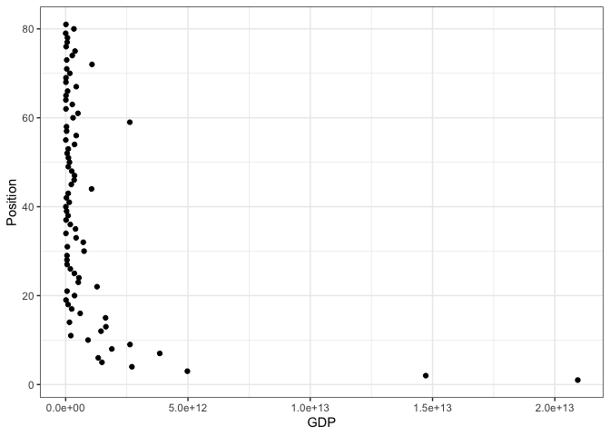

Homework
================
Daniel Li
08/11/2021

-   [Part 1 - Tokyo Olympics](#part-1---tokyo-olympics)
-   [Part 2 - Iris with multiple
    predictors](#part-2---iris-with-multiple-predictors)

# Part 1 - Tokyo Olympics

Load libraries

``` r
library(tidyverse)
```

    ## ── Attaching packages ─────────────────────────────────────── tidyverse 1.3.1 ──

    ## ✓ ggplot2 3.3.5     ✓ purrr   0.3.4
    ## ✓ tibble  3.1.5     ✓ dplyr   1.0.7
    ## ✓ tidyr   1.1.4     ✓ stringr 1.4.0
    ## ✓ readr   2.0.2     ✓ forcats 0.5.1

    ## ── Conflicts ────────────────────────────────────────── tidyverse_conflicts() ──
    ## x dplyr::filter() masks stats::filter()
    ## x dplyr::lag()    masks stats::lag()

``` r
library(vroom)
library(wbstats)
library(countrycode)
```

Find out how to get GDP for the countries (hint - we have used the
package in a previous week)

``` r
# set current working directory
setwd(dirname(rstudioapi::getActiveDocumentContext()$path))

# extract GDP data for all countries
gdp_data <- wb_data(indicator = "NY.GDP.MKTP.CD",
                    start_date = 2020,
                    end_date = 2020)

# convert to tibble
gdp_data <- as_tibble(gdp_data)

# rename GDP column
gdp_data <- gdp_data %>% rename(GDP = NY.GDP.MKTP.CD)
```

Merge the GDP data into the medal table (hint - check previous weeks for
how to do this too)

``` r
# import medal database
medal_data <- vroom("../../data/Workshop 5/Tokyo 2021 medals.csv")
```

    ## Rows: 89 Columns: 4

    ## ── Column specification ────────────────────────────────────────────────────────
    ## Delimiter: ","
    ## chr (1): Country
    ## dbl (3): Gold, Silver, Bronze

    ## 
    ## ℹ Use `spec()` to retrieve the full column specification for this data.
    ## ℹ Specify the column types or set `show_col_types = FALSE` to quiet this message.

``` r
# add country code column to medal_data
medal_data$iso3c <- countrycode(medal_data$Country,
                                  origin = "country.name",
                                  destination = "iso3c")
```

    ## Warning in countrycode_convert(sourcevar = sourcevar, origin = origin, destination = dest, : Some values were not matched unambiguously: Kosovo

``` r
# fix country code errors
medal_data$iso3c[which(medal_data$Country == "Kosovo")] <- "XKX"
medal_data$iso3c[which(medal_data$Country == "Republic of China")] <- "CHN"

medal_gdp_data <- left_join(medal_data,
                         gdp_data %>% select(iso3c, GDP),
                         by = c("iso3c" = "iso3c"))
```

Visualise the relationship between GDP and position in the table (hint -
which is your predictor variable?)

``` r
# Sort by Gold, Silver, Bronze, then alphabetical
medal_gdp_sort <- arrange(medal_gdp_data,
                           desc(medal_gdp_data$Gold),
                           desc(medal_gdp_data$Silver),
                           desc(medal_gdp_data$Bronze),
                           medal_gdp_data$Country)

# Omit NA GDPs
medal_gdp_sort <- medal_gdp_data[complete.cases(medal_gdp_data$GDP), ]

# create position column
medal_gdp_sort$Position <- seq.int(nrow(medal_gdp_sort))

ggplot(medal_gdp_sort, aes(x = GDP, y = Position)) +
  geom_point() +
  theme_bw()
```

<!-- -->

Fit an appropriate GLM to the data and check its assumptions

# Part 2 - Iris with multiple predictors
