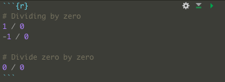
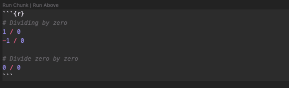

# Task

Use RMarkdown to summarise the most important bits of what you have learned so far - i.e. make a sort of cheat sheet for yourself of useful functions or insights. This will be different for everyone, so I won’t tell you what to put on it but I do suggest you include a table of useful functions which you have come across during your reading.

# Useful functions

View R function documentation within RStudio/VS Code or online at: <https://www.rdocumentation.org>

Function/usage                            | Description
:-----------------------------------------|:----------------------------------------------------------
?function()                               | Open help topic for function
??function()                              | Search help topics for function
c(…, recursive = FALSE, use.names = TRUE) | Combine Values into a Vector or List
as.factor(x)                              | Converts a column from numeric to factor
runif(n, min = 0, max = 1)                | Generate n random floats between min and max
is.numeric(x)                             | Check if vector is numeric
is.character(x)                           | Check if vector is a character
is.logical(x)                             | Check if vector is logical
sum(…, na.rm = FALSE)                     | Returns the sum of all the values present in its arguments
mean(x, trim = 0, na.rm = FALSE, …)       | Calculates arithmetic mean of arguments
ceiling(x)                                | Round to upper integer
floor(x)                                  | Round to lower integer
trunc(x, …)                               | Rounds towards 0
round(x, digits = 0)                      | Round to decimal digits given
signif(x, digits = 6)                     | Rounds to significant digits given
sqrt(x)                                   | Computes the square root of the specified float value
length(x)                                 | Return the length of a vector
names(x)                                  | Check the names of a vector or add names to a vector
sort(x, decreasing = FALSE, …)            | Sort a vector into ascending or descending order
function( arglist ) expr                  | Define new function
return(value)                             | Return the desired object from a function

## Week three functions

Function/usage                                | Description
:---------------------------------------------|:-----------------------------------------------------------
Function/operator                             | Call
Create a matrix                               | matrix()
Sequence of regular numbers                   | seq()
Dimensions of an object                       | dim()
Matrix multiplication                         | %*%
Transpose                                     | t()
Create matrix where diagonal is filled with x | diag()
Return the diagonal of a matrix               | diag()
Calculate eighenvalues and eigenvectors       | eigen()
Sums of the rows                              | rowSums()
Sums of the columns                           | cowSums()
Means of the rows                             | rowMeans()
Means of the columns                          | colMeans()
Make an array                                 | array()
Make a data.frame                             | data.frame()
Make a list                                   | list()
Install a package from CRAN                   | install.packages()
Install a package from Github                 | install_github()
Load a package into the global environment    | library()
Reading in data                               | vroom()
Set working directory to file location        | setwd(dirname(rstudioapi::getActiveDocumentContext()$path))
Check the class of an object                  | class()
Change a file from wide to long format        | pivot_longer()
Change a file from long to wide format        | pivot_wider()

## Week four functions

Function/operator                                            | Call
:------------------------------------------------------------|:-------------
Join data sets                                               | …_join()
Make a data frame into a tibble                              | as_tibble()
Filter out certain data                                      | filter()
Apply tidyverse functions to grouped data                    | group_by()
Extract summary data (e.g. mean)                             | summarise()
Find and set country code data                               | countrycode()
Show the numerical position in a vector of logical operators | which()
Add together values in a vector                              | sum()
Make a ggplot object                                         | ggplot()
Make a scatter plot                                          | geom_point()
Make a line plot                                             | geom_line()
Adjust theme of ggplot object                                | theme()
Plot grouped data on different plots                         | facet_wrap()
Make a .pdf file of a plot                                   | pdf()

# Week one insights

## Good coding practice

- Write complex code in .R document, not console
- Console is used for experimenting with code
- Comment code using `#` for legibility

## macOS keyboard shortcuts

Action                                | RStudio | VS Code
:-------------------------------------|:--------|:-------
Run current line                      | ⌘↩      | ⌘↩
Run all                               | ⌥⌘R     | ⇧⌘↩
Save file                             | ⌘S      | ⌘S
Comment out highlighted lines of code | -       | ⌘K, ⌘C
Uncomment highlighted lines of code   | -       | ⌘K, ⌘U
Indent highlighted lines of code      | ⇥       | ⇥
Outdent highlighted lines of code     | ⇧⇥      | ⇧⇥
Insert assignment operator            | ⌥-      | -

## Operators {.tabset}

### Basic maths operators

Basic maths | Code | Example
:-----------|:-----|:-------
Add         | +    | 1+1
Subtract    | -    | 2-4
Divide      | /    | 12/3
Multiply    | *    | 2*4
Power       | ^    | 3^2
Parentheses | ()   | 3*(1+2)

### Logical operators

Logical operator      | Code | Example
:---------------------|:-----|:-----------
Equal to              | ==   | c(1:5) == 2
Not equal to          | !=   | c(1:5) == 3
Less than             | <    | 4 < 5
More than             | >    | 3 > 5
Less than or equal to | <=   | c(1:5) <= 3
More than or equal to | >=   | c(1:5) >= 2
Or                    | \|   | x <- c(1:5) ; x > 3 | x < 2
Within                | %in% | 1:10 %in% c(1,3,5,9)

## Non-trivial answers

```{r}
# Dividing by zero
1 / 0
-1 / 0

# Divide zero by zero
0 / 0
```

## Writing your own functions

```{r, eval=FALSE}
# function layout below
function_name <- function(arg1, arg2, …) {
    var1 <- function_logic_here
    return(var1)
}

```

# Week two insights

## GitHub

- GitHub is an online repository for sharing/collaborating on code. Frontend for Git
- Git is a version control system

### GitHub concepts

Project code stored in repositories. Repositories are usually stored remotely/online (i.e. hosted on GitHub), however code is usually **cloned** to local environment and worked on locally/offline. Once significant progress has been achieved, a **commit** is created with a description of the changes, followed by a **push** to upload the changes to the online repository. If a local cloned repository is behind on commits present on a remote repository, the changes can be **pulled** from the remote repository.

All code in the repository exists on branches. The default branch is known as `main` (and previously `master`). New branches can be created to experiment with changes to the repository, without affecting code on main. As the main branch should always be functioning code, new features and fixes should be worked on in a branch and **merged** with main only when it is ready. Branch names should be descriptive of what is being worked on.

To work on the repository of another GitHub user, their repository can be **forked**. This places a copy of their repository under your GitHub user.

The version control aspect of Git means every change to the repository is recorded and can be reverted or reverted to.

- To reset local environment to previous commit

  `$ git reset --hard commit_SHA_here`

  `--hard` flag is passed to undo current changes (so repository files are restored to previous commit)

### GitHub repository files

- README.md - Provides information on the project. Document parsed as [GitHub Flavored Markdown (GFM)](https://github.github.com/gfm/)
- .gitignore - Files and folders to exclude from upload to repository
- .git folder - Folder containing information used by Git

## R Markdown

- Markdown document with inline executable R code chunks
- Provide document information in header of R Markdown file

- ```
---
title: "R Cheat Sheet"
author: "Daniel Li"
date: "10/10/2021"
output:
  html_document:
    toc: true
    toc_float: true
    number_sections: true
    toc_depth: 3
---
```

### Code chunks

Code chunks begin with ` ```{r, args} ` and end with ` ``` `:





Args for ` ```{r, args} `:

Arg               | Description
:-----------------|:--------------------
echo = TRUE/FALSE | Show/hide code chunk
eval = TRUE/FALSE | Run/don't run code
fig.cap="x"       | Figure caption for plots

Load packages in r setup script:

```{r setup, eval=FALSE}
# Load tidyverse
library(tidyverse)
```

Write database to file:

```{r, eval=FALSE}
setwd(dirname(rstudioapi::getActiveDocumentContext()$path))
vroom_write(to_sort_pop_total_long, "../week 3/to_sort_pop_total_long_left.csv")
```

# Week three insights

## Week three data types

- Matrices - 2 dimensions containing a single type of data
- Arrays are n dimensional matrices containing a single type of data
- data.frames (including tibble) can contain multiple data types
- Lists - structures containing nested information of multiple types

# Week four insights

left_join(): (return all rows from x, and all columns from x and y)
