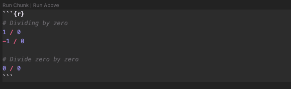

# Task

Use RMarkdown to summarise the most important bits of what you have learned so far - i.e. make a sort of cheat sheet for yourself of useful functions or insights. This will be different for everyone, so I won’t tell you what to put on it but I do suggest you **include a table of useful functions** which you have come across during your reading.

# Useful functions

View R function documentation within RStudio/VS Code or online at: <https://www.rdocumentation.org>

Function/usage                            | Description
:-----------------------------------------|:----------------------------------------------------------
?function()                               | Open help topic for function
??function()                              | Search help topics for function
c(…, recursive = FALSE, use.names = TRUE) | Combine Values into a Vector or List
as.factor(x)                              | Converts a column from numeric to factor
runif(n, min = 0, max = 1)                | Generate n random floats between min and max
is.numeric(x)                             | Check if vector is numeric
is.character(x)                           | Check if vector is a character
is.logical(x)                             | Check if vector is logical
sum(…, na.rm = FALSE)                     | Returns the sum of all the values present in its arguments
mean(x, trim = 0, na.rm = FALSE, …)       | Calculates arithmetic mean of arguments
ceiling(x)                                | Round to upper integer
floor(x)                                  | Round to lower integer
trunc(x, …)                               | Rounds towards 0
round(x, digits = 0)                      | Round to decimal digits given
signif(x, digits = 6)                     | Rounds to significant digits given
sqrt(x)                                   | Computes the square root of the specified float value
length(x)                                 | Return the length of a vector
names(x)                                  | Check the names of a vector or add names to a vector
sort(x, decreasing = FALSE, …)            | Sort a vector into ascending or descending order
function( arglist ) expr                  | Define new function
return(value)                             | Return the desired object from a function

# Week one insights

## Good coding practice

- Write complex code in .R document, not console
- Console is used for experimenting with code
- Comment code using `#` for legibility

## macOS keyboard shortcuts

Action                                | RStudio | VS Code
:-------------------------------------|:--------|:-------
Run current line                      | ⌘↩      | ⌘↩
Run all                               | ⌥⌘R     | ⇧⌘↩
Save file                             | ⌘S      | ⌘S
Comment out highlighted lines of code | -       | ⌘K, ⌘C
Uncomment highlighted lines of code   | -       | ⌘K, ⌘U
Indent highlighted lines of code      | ⇥       | ⇥
Outdent highlighted lines of code     | ⇧⇥      | ⇧⇥
Insert assignment operator            | ⌥-      | -

## Operators {.tabset}

### Basic maths operators

Basic maths | Code | Example
:-----------|:-----|:-------
Add         | +    | 1+1
Subtract    | -    | 2-4
Divide      | /    | 12/3
Multiply    | *    | 2*4
Power       | ^    | 3^2
Parentheses | ()   | 3*(1+2)

### Logical operators

Logical operator      | Code | Example
:---------------------|:-----|:-----------
Equal to              | ==   | c(1:5) == 2
Not equal to          | !=   | c(1:5) == 3
Less than             | <    | 4 < 5
More than             | >    | 3 > 5
Less than or equal to | <=   | c(1:5) <= 3
More than or equal to | >=   | c(1:5) >= 2
Or                    | \|   | x <- c(1:5) ; x > 3 | x < 2
Within                | %in% | 1:10 %in% c(1,3,5,9)

## Non-trivial answers

```{r}
# Dividing by zero
1 / 0
-1 / 0

# Divide zero by zero
0 / 0
```

## Writing your own functions

```{r, eval=FALSE}
# function layout below
function_name <- function(arg1, arg2, …) {
    var1 <- function_logic_here
    return(var1)
}

```

# Week two insights

## GitHub

- GitHub is an online repository for sharing/collaborating on code. Frontend for Git
- Git is a version control system

## R Markdown

- Markdown document with inline executable R code chunks
- Provide document information in header of R Markdown file
- ```
---
title: "R Cheat Sheet"
author: "Daniel Li"
date: "10/10/2021"
output:
  html_document:
    toc: true
    toc_float: true
    number_sections: true
    toc_depth: 3
---
```
### Code chunks

Code chunks begin with ` ```{r} ` and end with ` ``` `:

